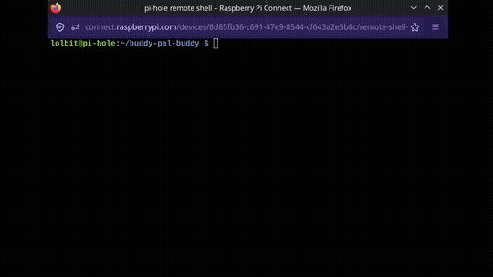

# buddy-pal-buddy

This is a project made for the [stardance challenge](https://stardance.hackclub.com/)!

This is a tamagotchi made for the Raspberry Pi and the [sense HAT](https://www.raspberrypi.com/products/sense-hat/)

It supports many features and works as a great DIY tamagotchi!

# How to play?

To play you must take care of it (just like a real tamagotchi!)

You can feed it by using the joy stick. Any button
works!

You also need to keep buddy in a nice temperature!
They can't be too hot or else they get heat stroke
but they can't be too cold or else they get frostbite
(for any nerds buddy can't be hotter than 110 fahrenheit
or 43.3 celsius and can't be colder than 68 fahrenheit
or 20. Also yes you can change these values in the
code)

You get 3 lives and if all three lives are gone buddy dies
and the program will exit. You lose these lives by
not taking care of buddy

# How to run it?

## trying it out

Not conviced yet?...

It's ok, it's hard to be a sales guy so here is a demo you can play online without any hardware.
Just a interntet connection and a web browser

You can play it out [here](https://trinket.io/python/c544e0be36c7) however it's limited.

If you want everything follow the next step

> for the cool nerds the source code of the demo is on both the website and here on github
> inside `demo.py`

## quick start

If you just want to get into it just run

`
    curl -s https://raw.githubusercontent.com/Drwhomust/buddy-pal-buddy/refs/heads/main/main.py | python
`

on your Pi with the sense HAT connected to it and the
program will take care of the rest

Don't worry about any packages, The version of python the Pi uses
has everything for the game!

## don't have a pi or hat?

If you don't have a sense HAT or not even a Pi this
project supports running it though an emulator

to set it up clone the repo

`git clone https://github.com/Drwhomust/buddy-pal-buddy.git`

and inside the source code folder inside `main.py`

change the `use_emu_sense` flag to True

should be:

`
use_emu_sense = True
`

then after that run:

`python main.py`

and your all good! Just make sure your emulator is
running to see it's output!

# I wanna to make custom charaters or show hints!

It's ok

You can do that too!

enable hints by setting `show_hints` to `True`

and as for the charaters make a 8x8 image and put
it inside the image folder and have each image be a differnt
emotion. Or set the path to your own inside the
`custom_path_buddy` flag (by default it uses
the image folder of the source code)

you will need to have

- Happy
- Blinking
- cold
- hot
- hungry

sprites to make this work!

feel free to use the one i made of my OC as a refence
when making your own

